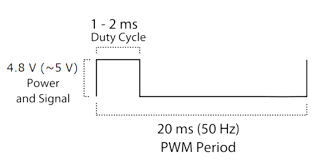
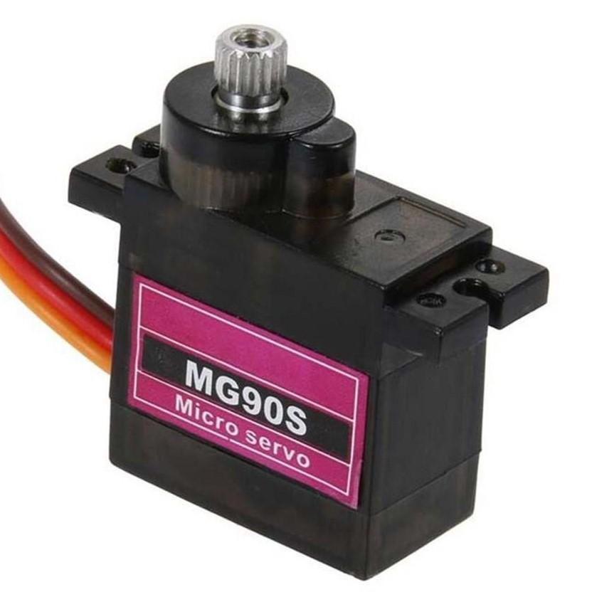
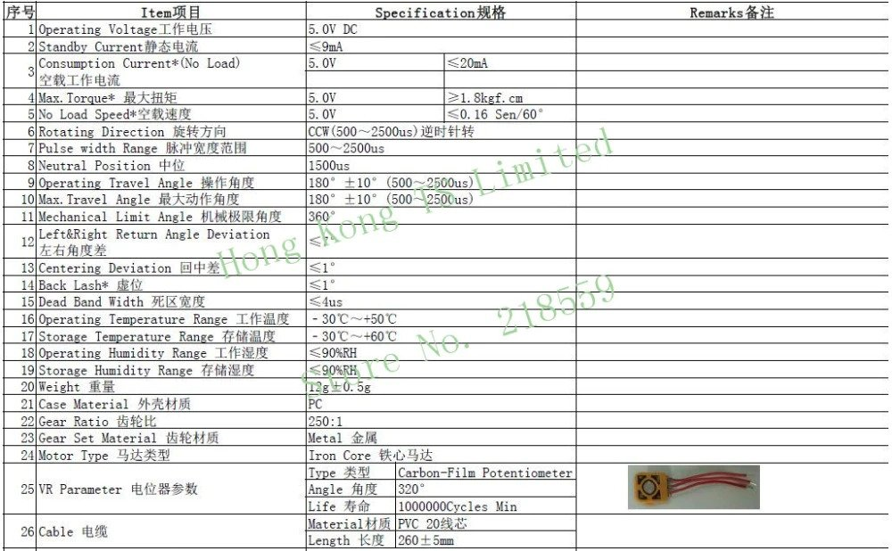
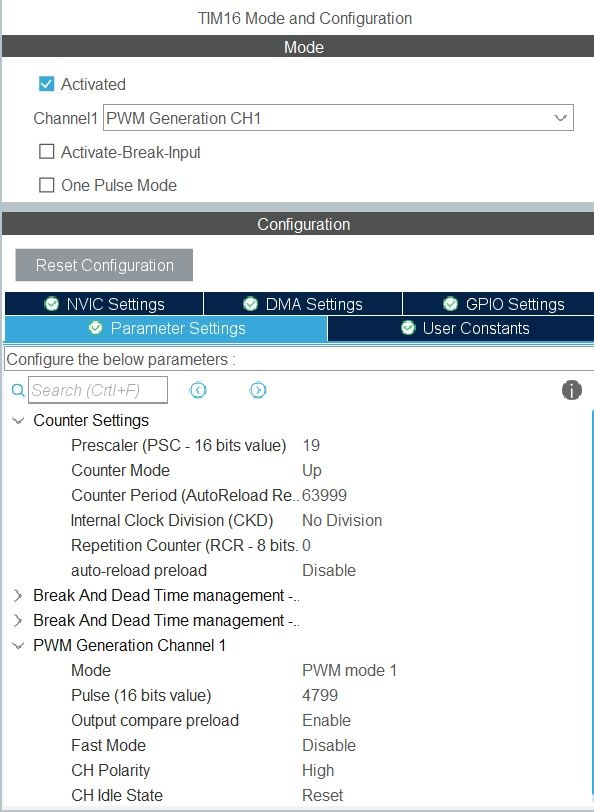

<h1>Servo Motor Driver</h1>

STM32 HAL & LL library for driving RC Servo motor.

Include standard and high resolution timer control method.

This example is using uart to control the rotatation of the servo.

## <ins>Concept</ins>

Standard way to driver servo is to configure pwm signal as below:

but some servo do had different requirement.

Here i tested MG90s Micro servo where i got it from taobao.

Base on the data sheet, it need pulse of 500-2500us to rotate 0-180 deg.

## <ins>Calculation</ins>

First we using normal single timer to generate PWM pulse as per requirement.

In order to get 50Hz pwm frequency, here is the calculation:

<!-- $$
Fpwm = \frac{Ftim}{(PSC * ARR)}
$$ --> 

<!-- $Fpwm = \frac{64MHz}{((19+1) * (63999+1))} = 50Hz$ -->

The datasheet show the servo turn to 0deg @ 0.5ms and 180deg @ 2.5ms,

From here we calculate 90deg should be around 4800

<!-- $CCR = ARR * 7.5\%$ --> 

  

<!-- $CCR = 64000 * 0.075 = 4800$ --> 

(10% = 2ms, 7.5% = 1.5ms, 5% = 1ms)

## <ins>Usage</ins>

Com Port baudrate: 115200

To find max and min S1 servo pulse:

``CAL S1 1850``

To set S1 rotatation angle 45deg

``ROT S1 45``